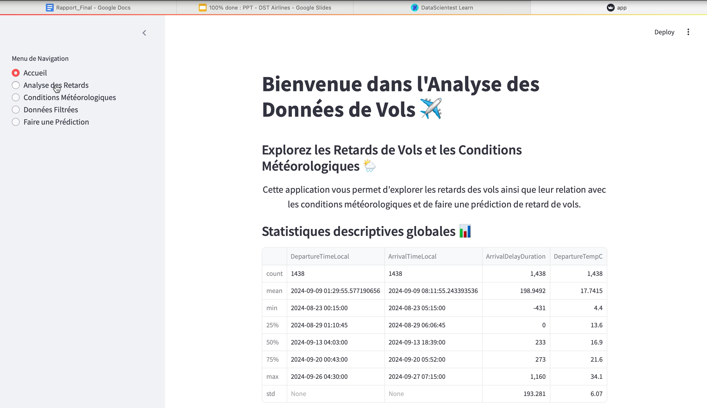
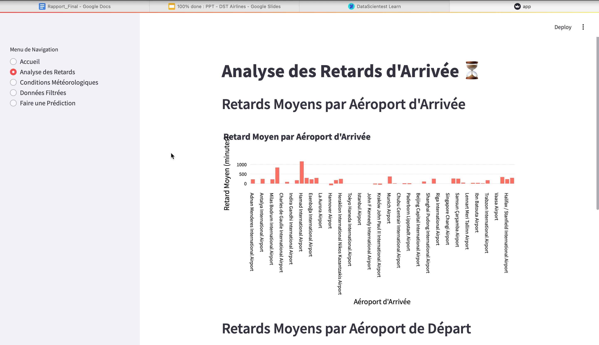
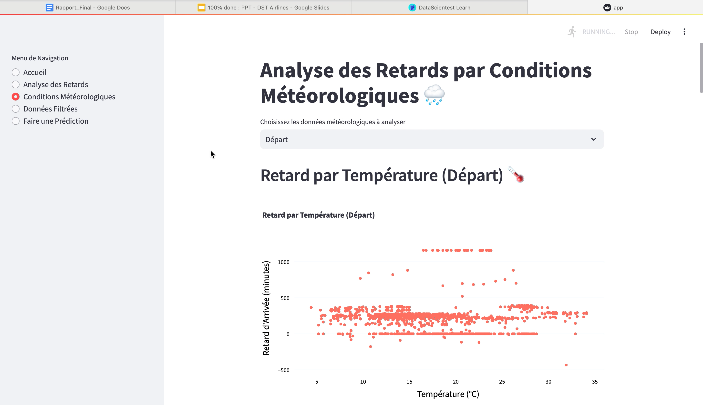
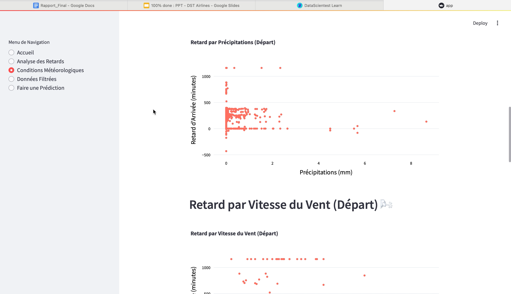
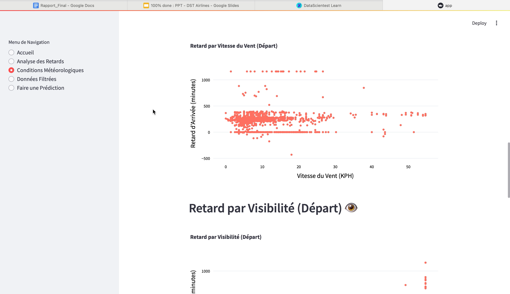
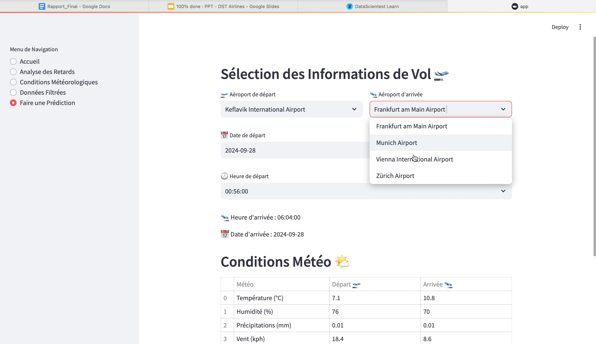
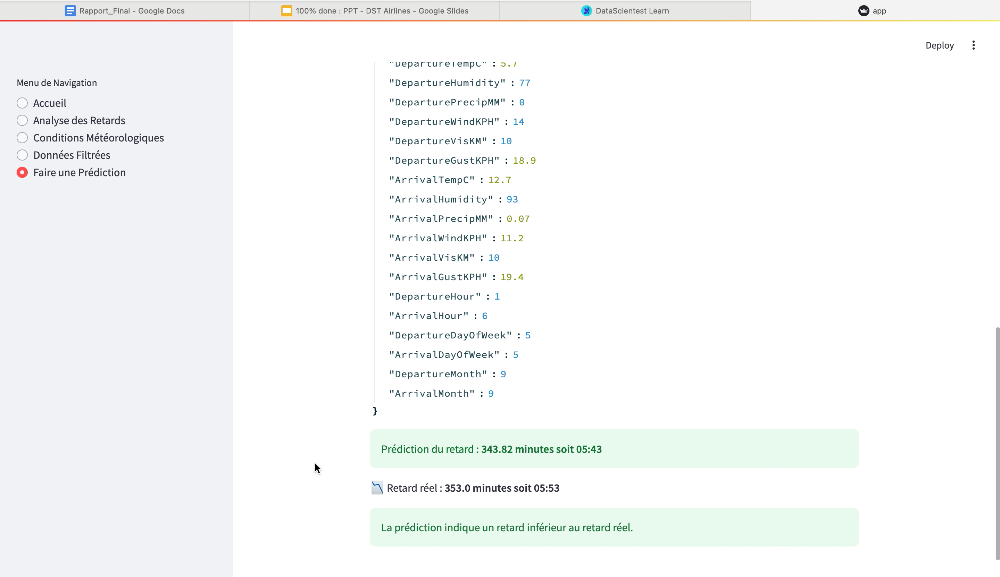

# ✈️ DST-Airline

> **Predict flight delays using real-time weather and flight data — from raw ingestion to an interactive dashboard, all in one place.**

## Table of contents

1. [Introduction](#introduction)
3. [Objective](#objective)
4. [Features](#features)
5. [Architecture](#architecture)
6. [Getting started](#getting-started)
7. [Project structure](#project-structure)
8. [Environment variables](#environment-variables)
9. [Usage](#usage)
10. [Dashboard preview](#dashboard-preview)
11. [Future improvements](#future-improvements)
12. [Contributors](#contributors)
13. [License](#license)

## Introduction

Flight delays can have a significant operational and financial impact. **DST-Airline** is a full-stack predictive application that leverages AI to forecast flight delays based on weather conditions. Developed as part of the Data Engineer Bootcamp by Datascientest, it covers:

- Data ingestion (Lufthansa API + WeatherAPI)
- Transformation & storage in MongoDB
- ML modeling (Random Forest)
- API serving with FastAPI
- UI with Streamlit

## Objective

Build a **machine learning model** to predict arrival delays based on:

- Departure and arrival airports, date and time
- Weather conditions at departure and arrival points

Everything is accessible via a **REST API** and visualized through an interactive dashboard.

## Features

| Module              | Description                                                         | Main file(s)                    |
|--------------------|---------------------------------------------------------------------|---------------------------------|
| 📥 Data ingestion   | Lufthansa + WeatherAPI → transform and store in MongoDB             | `import_history_data_luf.py`    |
| 🧠 Model training   | Feature engineering + Random Forest + evaluation (MSE, R², MAE)     | `models/trainModel.py`                 |
| 🌀 Prediction        | Load model and predict delay from JSON input                        | `models/predict.py`                    |
| ⚙️ FastAPI endpoint  | `/predict` route for inference                                     | `main.py` / `api.Dockerfile`    |
| 📊 Streamlit app    | Visualizations (analytics, weather impact, manual prediction form) | `app.py` / `streamlit.Dockerfile` |
| 🐳 Docker deployment| Orchestrates API + UI services                                     | `docker-compose.yml`            |

## Architecture
```
+-----------------------+         +--------------------+
| Lufthansa + Weather  |         |   MongoDB Atlas    |
|        APIs          +--------▶|  flights_with_wx   |
+-----------------------+         +--------------------+
         ▲                                 │
         │   import_history_data_luf.py    │
         │                                 ▼
+-----------------------+      +--------------------+
| models/trainModel.py  |      | preprocessors/     |
| (Random Forest + joblib) +--▶| model.pkl + scaler |
+-----------------------+      +--------------------+
                                         │
                   +---------------------┼----------------------+
                   │                                            │
           +-------▼--------+                         +---------▼--------+
           |    FastAPI     |                         |    Streamlit     |
           |   /predict     |                         |    dashboard     |
           +----------------+                         +------------------+
```

## Getting started

### 1. Clone the project
```bash
git clone [https://github.com/<your-org>/dst-airline.git](https://github.com/Kine1109/DST-Airline.git)
cd dst-airline
cp .env.example .env
```

### 2. Run with Docker

Before starting Docker, make sure to initialize your dataset and model locally:

```bash
python -m venv .venv && source .venv/bin/activate
pip install -r requirements.txt
python import_history_data_luf.py
python trainModel.py
```

Then build and run the containers:

```bash
docker-compose up --build
```
- API docs (Swagger): http://localhost:8000/docs  
- Dashboard: http://localhost:8501

### 3. Run locally (optional)
```bash
python -m venv .venv && source .venv/bin/activate
pip install -r requirements.txt
python import_history_data_luf.py
python trainModel.py
uvicorn main:app --reload
streamlit run app.py
```

## Project structure
```
DST-Airline/
├─ models/                  # trained model versions
├─ app.py                   # dashboard app
├─ main.py                  # FastAPI backend
├─ trainModel.py            # model training logic
├─ predict.py               # standalone prediction script
├─ import_history_data_luf.py # data ingestion script
├─ docker-compose.yml       # container orchestration
├─ .env / .env.example      # environment settings
└─ *.Dockerfile             # Docker images
```

## Environment variables
| Variable | Description              |
|----------|--------------------------|
| `API_KEY` | WeatherAPI key           |
| `CLIENT_ID` / `CLIENT_SECRET` | Lufthansa API credentials |
| `MONGO_URI` | MongoDB Atlas URI      |

## Usage

1. **Refresh the dataset**: `python import_history_data_luf.py`
2. **Train a model**: `python trainModel.py`
3. **Test the prediction API**:
```bash
curl -X POST http://localhost:8000/predict      -H "Content-Type: application/json"      -d '{"DepartureAirport": "CDG", "ArrivalAirport": "JFK", ...}'
```
4. **Explore the dashboard**: http://localhost:8501

## Dashboard preview

### Overview & statistics
Descriptive analytics (flight delays, temperature, humidity, etc.)



### Delay analysis
Compare average delays by airport (departure vs arrival)



### Weather conditions
Correlations between weather (precipitation, wind, visibility) and delay severity







### Live prediction
Form to input flight info → API call → display estimated delay





## Future improvements
- 🔄 Automate data ingestion + model retraining with Airflow
- 🧪 Add validation set and improve metrics tracking
- 🐳 CI/CD pipeline & cloud deployment (e.g. Railway, Render)
- 📉 Monitor data drift in production

## Contributors
This project was built as part of the Data Engineer Bootcamp – July 2024, by:

- Fatou Kiné Sow  
- Mohamed Bouhandira  
- Rawane Seck  
- Fayssal Haddad  

Mentor: Antoine Fradin – Datascientest

## License
MIT — see LICENSE file.
